# 可综合的异步FIFO的设计与仿真 <!-- no toc --> 
- [可综合的异步FIFO的设计与仿真](#可综合的异步fifo的设计与仿真)
- [综述](#综述)
- [同步FIFO](#同步fifo)
- [异步FIFO](#异步fifo)
  - [格雷码与二进制计数器](#格雷码与二进制计数器)
    - [二进制计数器](#二进制计数器)
    - [格雷码](#格雷码)
    - [二进制双向箭头↔格雷码之间的相互转换](#二进制双向箭头格雷码之间的相互转换)
- [异步FIFO的代码实现](#异步fifo的代码实现)
  - [整体框图](#整体框图)
  - [格雷码做多bit信号同步](#格雷码做多bit信号同步)
  - [空满生成模块](#空满生成模块)
  - [存储器模块](#存储器模块)
  - [读写指针同步模块](#读写指针同步模块)
  - [顶层模块](#顶层模块)
  - [仿真](#仿真)
    - [仿真情景1：写满](#仿真情景1写满)
    - [仿真情景2：读空](#仿真情景2读空)
    - [写满后读，读十六个数后，空信号立即拉高。读使能拉高后，满信号延时拉低。](#写满后读读十六个数后空信号立即拉高读使能拉高后满信号延时拉低)
    - [仿真情景3：读写同时](#仿真情景3读写同时)
- [总结](#总结)
# 综述
FIFO（First in First out），经常用来对跨时钟域多bit数据的同步处理。常用的有同步FIFO与异步FIFO，本文主要处理异步FIFO的问题。首先，试图将多个变化的信号从一个时钟域同步到一个新的时钟域，并确保所有变化的信号都同步到新时钟域的同一个时钟周期，已经被证明是有问题的，在CDC部分中已经进行了说明，后续也会进一步的解释。这也是为什么引入格雷码来做数据同步的原因。在FIFO设计中判断FIFO的空满状态，是一个关键性的问题。另外，异步FIFO的设计思路可以对同步FIFO的设计做参考，本文主要针对异步FIFO设计进行分析。简单来说，FIFO就是一块RAM以及周围的控制电路组成的\~写入部分看有没有满，读端看有没有空。
本文会在前面介绍相关的理论知识，后半部分的代码实现将详细描述整体的模块划分以及各个模块的功能。最后的总结部分将会对该FIFO的优缺点进行描述。同时对本文进一步分析。
# 同步FIFO
由于读写是在一个时钟域下的，同步FIFO的实现主要是计算FIFO缓冲区的读写数量进行比较，以增加（在FIFO写但没有读时）、减少（在FIFO读但没有写时）或保持（没有写和读，或同时写和读操作）FIFO缓冲区的当前填充值。当FIFO计数器达到预定的满值时，FIFO就是满的，当FIFO计数器为零时，FIFO就是空的。缓冲区的数量就可以之间对FIFO的空满进行判断。
简单来讲，就是每一次读写都进行一次计数，通过计数的结果来判断空满。这里会引入一个问题，就是这个缓冲区数量统计是在那个时钟域下呢？即使是同步时钟，但是涉及快慢时钟的问题，且读写时钟之间的关系是不确定的。这里提供一个思路，若是已经知道读写时钟那个快，可以是使用快时钟对慢时钟的使能进行打拍，然后使用打拍后的沿作为计数器的计数控制使能信号，带来的问题是不能发起连续的读。好处是节约寄存器。另一种思路是设置两个计数器，实现方式如下面描述的异步FIFO类似。空满判断的方式也是一样的，但是不需要进行同步处理。
# 异步FIFO
对于异步FIFO，因为需要两个不同的异步时钟来控制该计数器。每次写入一个数，都需要判断是否是满的，每次读一个数，都需要判断是否是空的。为了确定异步FIFO设计的满和空状态，就必须对写和读指针进行比较（读写指针可以理解为读写的存储器空间地址）。如下是空满条件的判断示意图。
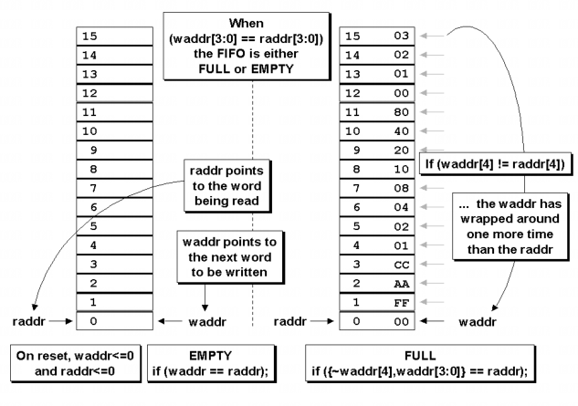
开始复位撤离，读写地址是相等的，空标志有效，第一次写时，空标志无效，写指针递增，以指向下一个需要写入的位置，读指针依旧在指向第一个FIFO存储器的内容。空标志首先在写时钟域产生，需要同步到读时钟域，才可以进行读操作。这个时候就会产生第一个问题，可以读的时候不能读。此时若是写入快，读数据慢，会出现写指针追上读指针的情况。这时候也会出现写指针等于读指针的情况。需要增加一位来高位来判断读写指针相同的时候是空还是满。实现方式如下，假设读指针指向0地址，写指针写了一圈回来，又到了0地址。这个时候地址自加1，变成了5'b1_0000，最高位是1，而此时读指针最高位依旧是0。通过判断最高位是不是相同的，若是不同，则表示满状态，反之。如上图所示，若是写入地址位宽为4，则实际上的地址位宽为4+1。对于这种方式设计处理空满状态情况的，n位指针，其中n-1位为可读写位置的FIFO存储空间。使用如下代码可以对FIFO的空满信号的产生进行测试，注意，只能是测试，不可综合！！！在实际使用中需要考虑数据同步的问题。下图只是论文作者补充的为了方便理解空满信号的，用于调试的代码。这里给出仅供思考。
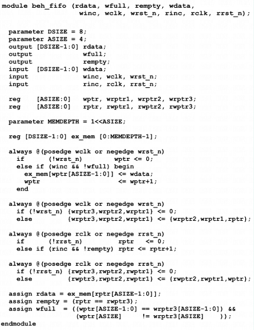

## 格雷码与二进制计数器
### 二进制计数器
我们在CDC多bit问题上没有使用打拍的方式，假设我们对一个2bit计数器打拍做同步，会有怎么样的结果呢？假设一个数从11-00发生变化，出现亚稳态，可能的结果为11-01，11-00，11-10，11-11，二级寄存器的输出的值就有一拍可能为这些值，显然同步后的数据都是不可预期的！！！如下图所示，由于线延时不同，导致输出有一拍的X4，Y4的输出有一拍的10信号（不应该有的）。而在实际使用中，延时的任何情况都是有可能的，显然这会导致逻辑不可预期，这只是2bit，当bit数更多，可能的结果也就更多。这也是为什么多bit不可以使用打拍进行同步的原因。因此需要引入格雷码进行同步\~
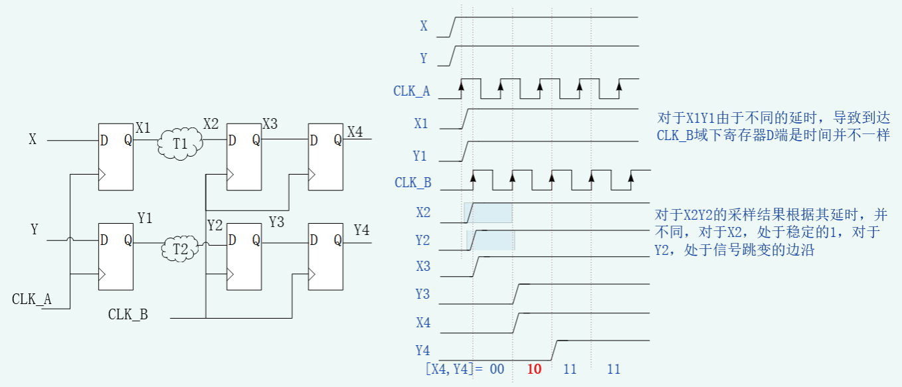

### 格雷码
格雷码是以1953年最初为该代码申请专利的人弗兰克·格雷命名的。关于格雷码，首先需要知道的是：**每两个相邻数之间只有1bit数是由变化的**，每一次变化也就只有一个bit可以更改，从而消除了同步时修改多个bit导致同步失败的问题。关于格雷码计数器，需要知道的是，**最有效的格雷码计数必须是具有2的幂计数**。因此本文所描述的都是2<sup>n</sup>深度的FIFO。下图所示是格雷码的举例，可以看到其特点；
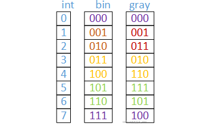
### 二进制双向箭头↔格雷码之间的相互转换
转化算法示意图如下，将分小节进一步描述具体的实现方式
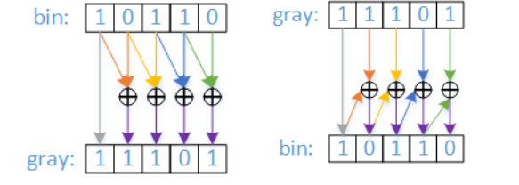
**二进制转格雷码**
为了将二进制值转换为等价的格雷码值，以n位二进制值为例，格雷码位0等于二进制位0和1的异或。格雷码位1等于二进制位1和2的异或，依此类推。最高有效的格雷码位正好等于最高有效的二进制位。

```
module bin2gray #(parameter SIZE = 4)
(output logic \[SIZE-1:0\] gray,
input logic \[SIZE-1:0\] bin);
assign gray = (bin>\>1) ^ bin;
endmodule
```

**格雷码转二进制**
为了将格雷码值转换成等价的二进制码值，以n位格雷码值为例，二进制位0等于格雷码位0与从1到n的所有其他格雷码位进行异或。二进制位1等于格雷码位1与从2到n的所有其他格雷码位进行异或，依此类推。最高有效二进制位恰好等于最高有效格雷码位。示例4位格雷到二进制转换的公式如下所示：

```
bin\[0\] = gray\[3\] ^ gray\[2\] ^ gray\[1\] ^ gray\[0\];
bin\[1\] = gray\[3\] ^ gray\[2\] ^ gray\[1\];
bin\[2\] = gray\[3\] ^ gray\[2\];
bin\[3\] = gray\[3\];
```

对格雷-二进制转换器进行编码的最简单方法是编写一个for循环，并对具有可变索引范围的格雷码向量进行异或运算，每次循环中索引范围的LSB都会增加，直到我们得到一个简单的赋值bin\[MSB\]=^Gray\[MSB：MSB\](就是格雷码向量的1位MSB)，如下所示

```
module gray2bin_bad #(parameter SIZE = 4)
(output logic \[SIZE-1:0\] bin,
input logic \[SIZE-1:0\] gray);
// Syntax Error - variable index range
always_comb
for (int i=0; i\<SIZE; i++)
bin\[i\] = ^(gray\[SIZE-1:i\]);
endmodule
```

不幸的是，Verilog和SystemVerilog不允许使用变量索引范围进行部分选择，因此上述示例的代码虽然在概念上是正确的，但不会编译。要解决这个问题，请记住异或门实际上是可编程逆变器。如果一个输入是高的，则另一个输入被反转并传递给输出。类似地，如果一个输入被绑定为低，则另一个输入被传递到输出而不进行反转(从输入到输出没有变化)。利用涉及0输入的任何加法异或运算不会改变运算结果这一事实，实现格雷码到二进制转换的方法是对有效格雷码比特进行异或，并填充0。

```
bin\[0\] = gray\[3\] ^ gray\[2\] ^ gray\[1\] ^ gray\[0\] ; // gray>\>0
bin\[1\] = 1'b0 ^ gray\[3\] ^ gray\[2\] ^ gray\[1\] ; // gray>\>1
bin\[2\] = 1'b0 ^ 1'b0 ^ gray\[3\] ^ gray\[2\] ; // gray>\>2
bin\[3\] = 1'b0 ^ 1'b0 ^ 1'b0 ^ gray\[3\] ; // gray>\>3
```

将上述转化为如下形式，是可以编译的。下面给出了两种形式，一种是SV模型，另一种是对于Verilog支持的generate for形式。

```
module gray2bin #(parameter SIZE = 4)
(output logic \[SIZE-1:0\] bin,
input logic \[SIZE-1:0\] gray);
always_comb
for (int i=0; i\<SIZE; i++)
bin\[i\] = ^(gray>\>i);
endmodule

module gray2bin #(parameter SIZE = 4)
(output wire \[SIZE-1:0\] bin,
input wire \[SIZE-1:0\] gray);
genvar i;
generate
for (int i=0; i\<SIZE; i++) begin: loop_name_a
assign bin\[i\] = ^(gray>\>i);
end
endgenerate
endmodule
```

当输入绑定到0时，综合工具会自动将其优化，不生成对应的电路。

# 异步FIFO的代码实现
## 整体框图

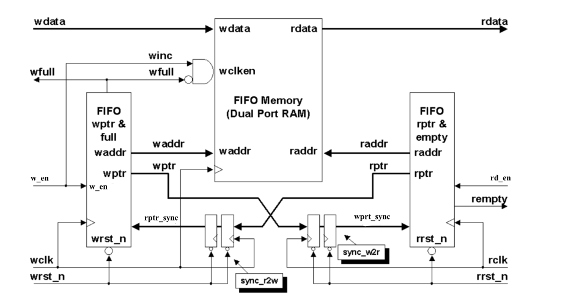
首先是FIFO顶层fifo.v。主要是实例化其他组件，将端口预留出来。fifo_mem.v是ram的实例化模块，这是可由写时钟域和读时钟域访问的FIFO存储器缓冲区。该缓冲区很可能是实例化的同步双端口RAM。可以调整其他存储器类型以用作FIFO缓冲器。sync_r2w.v这个模块主要是读到写地址的指针同步模块，sync_w2r.v这个模块主要是写到读地址的指针同步模块，rptr_empty.v该模块与读时钟域完全同步，并包含FIFO读指针和空标志逻辑。wptr_full.v该模块与写时钟域完全同步，并包含FIFO写指针和满标志逻辑。
为了使用这种FIFO风格执行FIFO满和FIFO空测试，读指针和写指针必须传递到相反的时钟域以进行指针比较。与其他FIFO设计一样，由于这两个指针来自两个不同的时钟域，因此需要将指针“安全”地传递到相反的时钟域。本文提出的是同步格雷码指针，以确保一次只有一个指针位可以改变。
FIFO满和FIFO空的具体实现方式取决于设计。本文的FIFO设计假设在读时钟域中产生空标志，以确保当FIFO缓冲器为空时，即读指针赶上写指针(包括指针MSB)的时刻，立即检测到空标志。本文中的FIFO设计假设在写时钟域中产生满标志，以确保当FIFO缓冲器已满时，即写指针赶上读指针的时刻(不同的指针MSB除外)，立即检测满标志。
命名解释：ptr：pointer，指针。inc：Increase，增加，这里可以理解为写使能（WE，Write Enable），与wdata同拍有效。
## 格雷码做多bit信号同步
我们上边解释了多bit同时改变这种情况不能直接使用打拍进行同步的原因，但是没有证明为什么使用格雷码来进行同步是可以的！接下来我们这个小节将会介绍为什么使用格雷码做同步是可以的！根据此，这是我们进行理论分析的最后一个模块。
还是之前那个例子：我们假设需要传递的数据为10-11-01，每一次只有1bit发生变化，其中颜色标识的为可能发生亚稳态的信号。其中红色为亚稳态的另一种情况。下图所示，同步后的数据，均是在合理的预期范围之内的。不会读到错误的数，只会读到历史的指针，就不会出现指针乱飞的情况。对于时钟，其中两个时钟虽然频率相同，但是相位关系不确定，因此是异步关系。
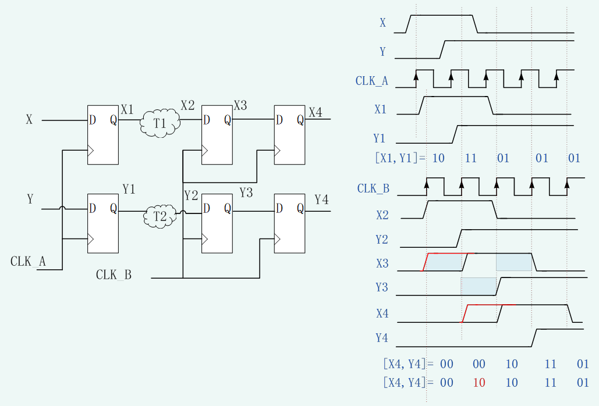
这里有一个思考，假设读写时钟频率差距比较大的时候，这个方式是否可以同步成功呢？我们需要思考这个方式同步的本质其实就是使用打两拍的方式来进行同步的，但是若是频率差距不满足三边沿定理，则会出现漏采样的问题。这样，会出现**漏采样**的问题，就会出现指针指针乱飞，这个是在慢时钟域去采样快时钟域的信号时候会有的问题。假设写时钟比较慢，这个时候，读时钟域一定可以采样到正确的写指针，这个时候呢，并不会有不正确的空信号，略微悲观的现象我们认为设计是正确的。那对于写时钟，我们读既然不会出现读空，也就是说，传进来的地址一定是没有超越写指针一轮的地址，这个时候，假设我们漏采样了，也是问题不大的，因为这个时候不会有超过写指针的读指针传递过来，极限就是读空。所以即使读写时钟的频率相差很大，这个时候也是没有关系的\~**有一个前提，是快时钟的频率没有快到两个时钟周期都处于慢时钟的亚稳态窗口（就是慢时钟域下寄存器的建立时间+保持时间，或者从另一个角度解释，并没有在采样时有两个bit信号同时发生翻转）**。这里时序图绘制不是很规范，不在此进行展示，后续有符合规范的图将进一步补充。
总结：我们不能同时进行多bit的同步的原因，归根到底就是亚稳态会导致多bit组成出预取之外的结果，而若是不在同一个时钟周期进行变化，就会避免这种情况，若是有亚稳态的问题，同步器会将其处理，保证在同步器的输出不会有预期之外的数据，也就是在寄存器的X4，Y4就会将正确的值输出。这就是为什么格雷码可以直接打拍处理的原因。
## 空满生成模块
FIFO满和FIFO空的具体实现方式取决于设计。本文的FIFO设计假设在读时钟域中产生空标志，以确保当FIFO缓冲器为空时，即读指针赶上写指针(包括指针MSB)的时刻，立即检测到空标志。本文中的FIFO设计假设在写时钟域中产生满标志，以确保当FIFO缓冲器已满时，即写指针赶上读指针的时刻(不同的指针MSB除外)，立即检测满标志。wptr_full.v以及rptr_empty.v两个模块就是实现空满信号以及读写指针，读写地址的产生。由于满信号是在写时钟域生成的，但是读指针需要同步到写时钟域，这个时候就可能出现已经发生了读动作，但是写时钟域由于时钟的延时，没有接收到读，就会产生可以写但是以为不能写的情况。空信号是在读时钟域产生的，但是写指针需要从写时钟域同步到读时钟域，会发生可以读但是空信号一直拉高的时候，造成可以读但是以为不能读。显然这种其实都是可以接收的，不会出现满的时候写以及空的时候读，造成逻辑错误。这其实都是略显得悲观的设计，并不是设计的问题。
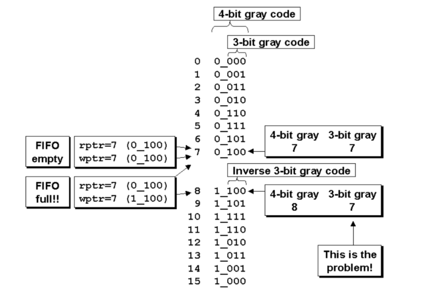
上图示例我们设计深度为8的FIFO时候，应该使用4bit，其中最高两位作为空满的条件判断。得到满标志产生的控制逻辑如下所示
assign wfull_flag = ((w_gray_next\[ADDRSIZE\] != rptr_sync\[ADDRSIZE\] ) &&
(w_gray_next\[ADDRSIZE-1\] != rptr_sync\[ADDRSIZE-1\]) &&
(w_gray_next\[ADDRSIZE-2:0\]== rptr_sync\[ADDRSIZE-2:0\]));
或是如下形式
assign wfull_flag = (w_gray_next\[ADDRSIZE:0\]== {\~rptr_sync\[ADDRSIZE:ADDRSIZE-1\],
rptr_sync\[ADDRSIZE-2:0\]});
对于空条件也是一样的逻辑，更为简单，不在此进行赘述，代码如下所示
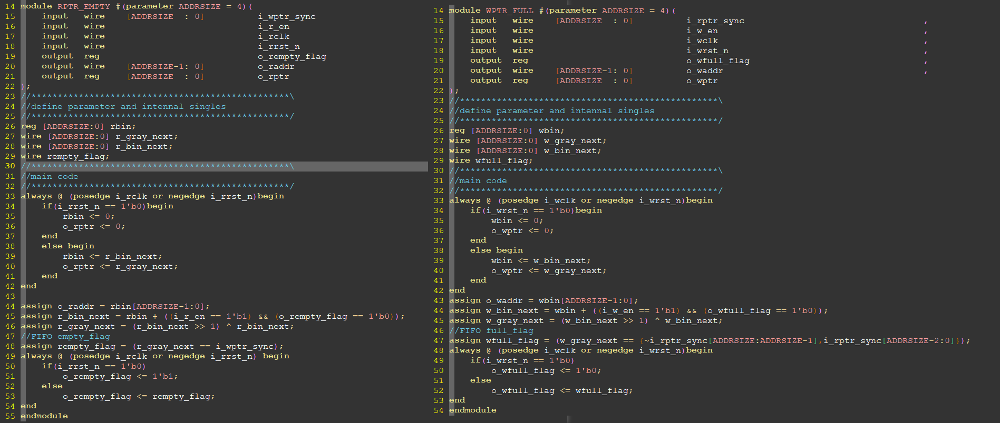
## 存储器模块
代码如下所示，主要是定义了是否使用IP或是数组作为寄存器。
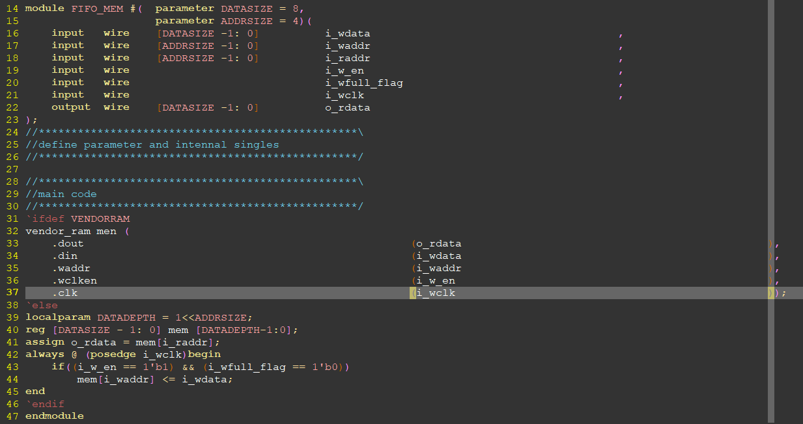
## 读写指针同步模块
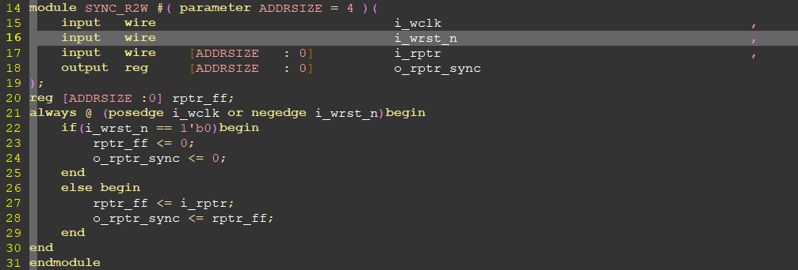

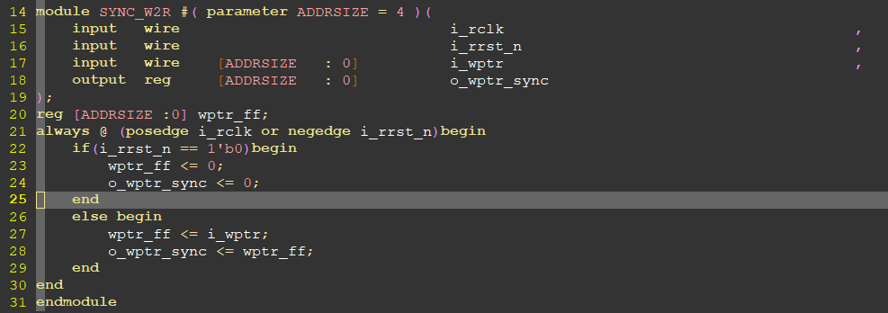
## 顶层模块
顶层模块主要是模块的集成，相互之前的连线。还有一个复位的同步释放模块。代码如下所示。
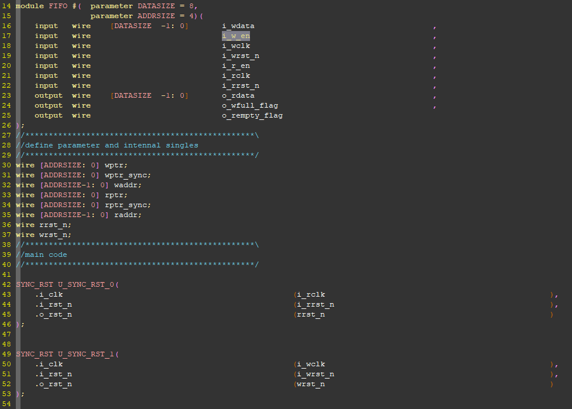

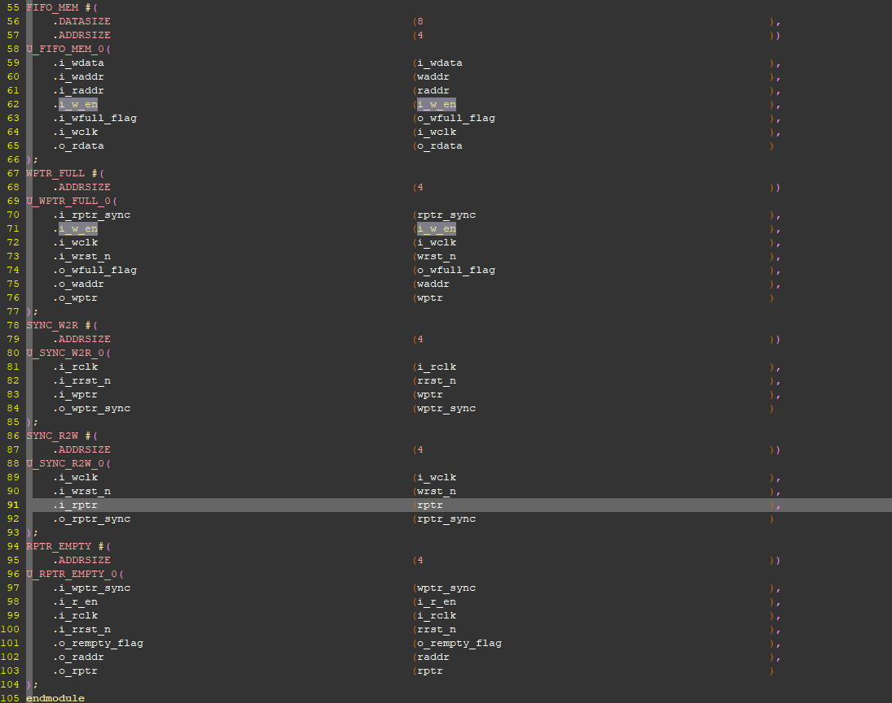

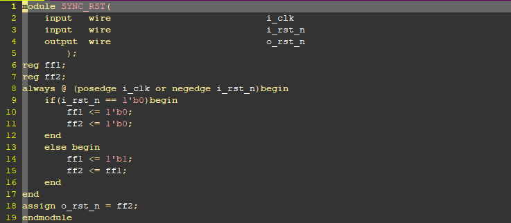
## 仿真
如下给出的三种场景是特殊场景，给出的仿真激励将于代码在github地址给出。可以查看地址同步的问题，在前面理论部分已经描述，可以看到有漏采样的情况。更细节的波形可以自行查阅。仿真工具使用questasim，其中sim.do文件也已经给出。
### 仿真情景1：写满
测试场景：写入使能连续拉高，写到16个数后，满信号立即拉高。写入数据后，空信号延时拉低。
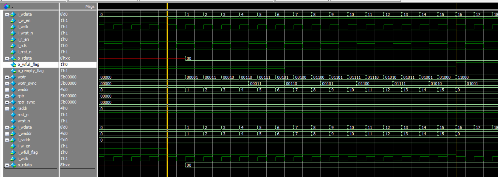
### 仿真情景2：读空
### 写满后读，读十六个数后，空信号立即拉高。读使能拉高后，满信号延时拉低。
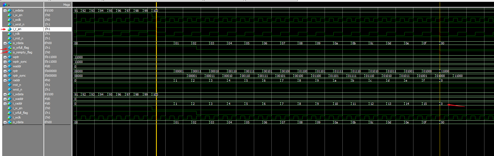
### 仿真情景3：读写同时
读写使能同时拉高，两个时钟频率相差位两倍。
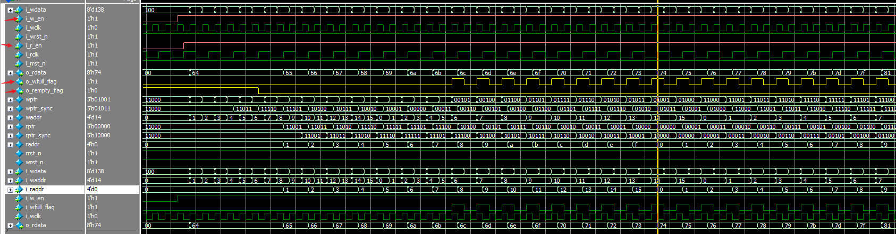

# 总结
FIFO的设计其实取决于具体的实际应用，个人觉得没有一个完美的FIFO，可以cover功能，面积，功耗（PPA），只能是根据同步的原则，选择进行合适的设计。更具体的来看，首先这上述FIFO的men模块，使用的是单口ram，并没有rdata的有效信号，是一个类似1 in 0 output的一个ram形式，输出可能有一定的延时。可以根据需要将其换位双口ram，个人感觉这里其实换成双口ram其实意义不是很大，有业务需求可以考虑。另外的优化是关于同步的，这里的同步使用的是格雷码进行同步的，我们也可以将其换位其他的同步方式，例如dmux，握手等，具体的功能以及效率笔者没有进行比较，只是提供一个可能的方向。最后是关于同步方式的总结，格雷码其实就是打拍的方式，所以说打拍可以说是CDC唯一的解决方案了。不管是多bit还是单bit，都多多少少使用了打拍的功能，可能具体的功能不通过，例如同步器打拍就是为了消除亚稳态，但是d_mux的打拍其实就是将多bit数据的稳定用单bit信号来保证，其实可以说是一个信号，或者标志……清楚同步的基本原则，再次基础上，就可以设计出稳定，可靠，的异步电路了。当然更进一步的功能保证其实是验证以及工具来保证的，但是首先清楚这些原则是必不可少的\~
至此，CDC问题基本上已经总结完毕啦\~
*本文参考：CummingsSNUG2002SJ_FIFO-Simulation and Synthesis Techniques for Asynchronous FIFO Design*
